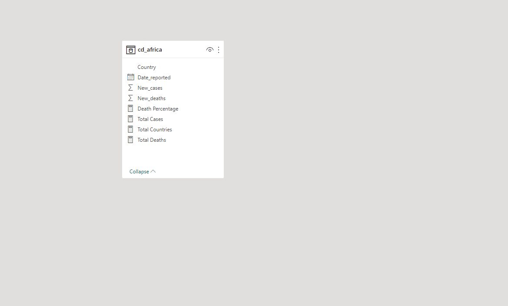
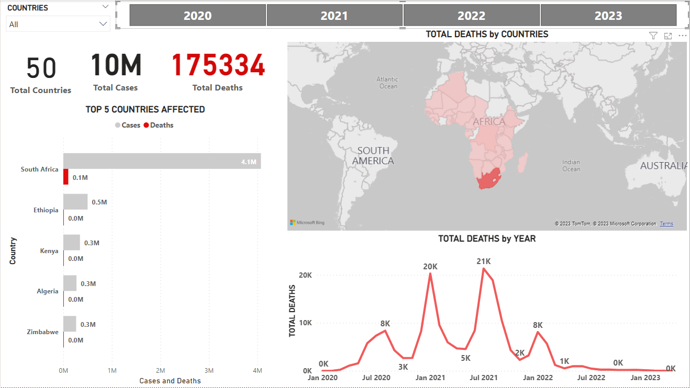

# COVID-19-Exploratory-Data-Analysis of African Countries
## by Kola Ademola
___

___
## INTRODUCTION
___
I decided to do an exporatory analysis of the Covid-19 provided by WHO.  
I focused on Africa for this particuar analysis, and it was an exciting experience and learning process for me.  
___
## DATA SOURCING
___
The dataset was gotten from the WHO official [website](https://covid19.who.int/WHO-COVID-19-global-data.csv) and my analysis was done with python using jupyter notebook  
___
## SKILLS DEMONSTRATED & DATA TRANSFORMATION
___
I used python for **data cleaning & data wrangling** before exporting the clean data to Power BI for visualizations.
Libraries used for cleaning in Python;  
___LIBRARIES USED___

___FILTERED THE DATA FOR JUST AFRICAN COUNTRIES___

___FEATURE ENGINEERED SOME NEW COLUMNS NECCESARY FOR MY ANALYSIS___

___EXPORTING DATASET TO POWER BI___

___DAX / MEASURES CREATED___

___

___
## DATA MODELLING
___
* NO modelling was done in Power BI because our data is all in a single table

___
## ANALYSIS & VISUALIZATIONS
___
This analysis contains just one report or dashboard page;  
___DASHBOARD___

___View Full Interactive Report/Dashboard [Here.](https://app.powerbi.com/view?r=eyJrIjoiNTM5OGQzMTMtMGEyZC00MGZjLTg4MTAtZWUxMDE4OGUzMjI1IiwidCI6ImQyMzQyMjIxLWJiM2ItNGQ1ZS04NWRmLTkyYzFlOTg0YTNlZCJ9)___
##### From the dashboard we can see that;
* 50 African countries were used for this analysis..
* **10 million** recorded cases.
* **175,000+** deaths were recorded sadly.  
* Africa was affected more between **January 2021** - **January 2022**

___Top 5 affected countries.___

* With **South Africa** recording the highest number of cases and fatalities.

* By **2023** there has been a significant decline in the number of cases and fatalities, but **Zimbabwe** in this case is recording more deaths.

___
## CONCLUSIONS & RECCOMMENDATIONS
___
This was a very simple analysis and it helped me gain insight on how COVID-19 has affected the continent because I have always wanted to know how much it affected Africa as compared to other continents, with this I can say not so much but every life is important and my deepest condolonce to all those affected.  
___RECCOMMENDATION___
* From the simple analysis I carried out, **South Africa** is the country mostly affected and I think they should have a much more strict COVID-19 policy in place.
### THANK YOU FOR TAKING THE TIME TO GO THROUGH THIS REPORT
