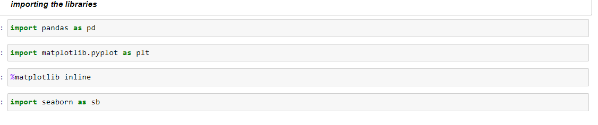
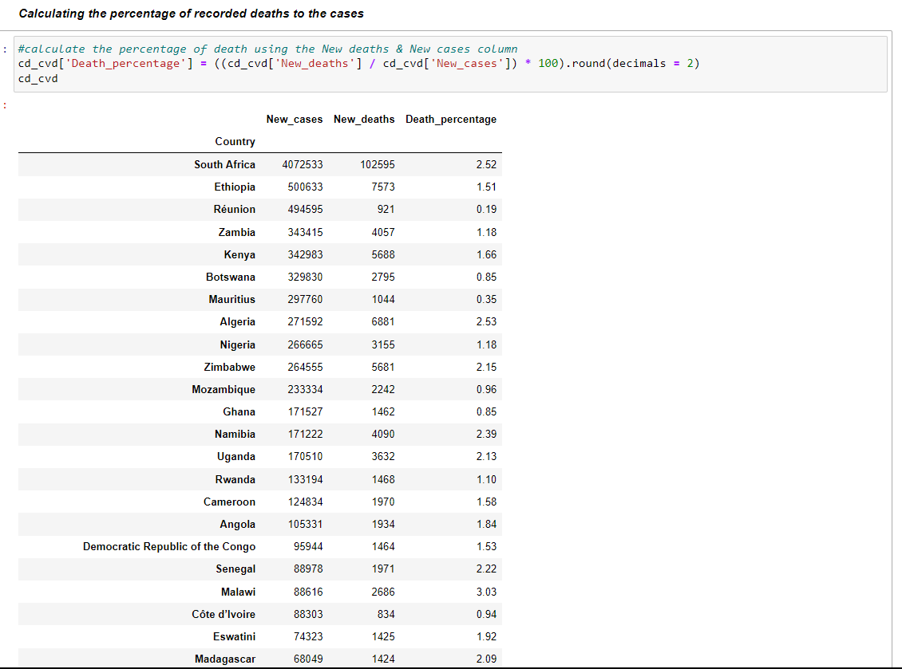

# COVID-19-Exploratory-Data-Analysis of African Countries
## by Kola Ademola
___

___
## INTRODUCTION
___
I decided to do an exporatory analysis of the Covid-19 provided by WHO.  
I focused on Africa for this particuar analysis, and it was an exciting experience and learning process for me.  
___
## DATA SOURCING
___
The dataset was gotten from the WHO official [website](https://covid19.who.int/WHO-COVID-19-global-data.csv) and my analysis was done with python using jupyter notebook  
___
## SKILLS DEMONSTRATED & DATA TRANSFORMATION
___
I used python for **data cleaning & data wrangling** before exporting the clean data to Power BI for visualizations.
Libraries used for cleaning in Python;  
___LIBRARIES USED___

___FILTERED THE DATA FOR JUST AFRICAN COUNTRIES___

___FEATURE ENGINEERED SOME NEW COLUMNS NECCESARY FOR MY ANALYSIS___

___EXPORTING DATASET TO POWER BI___

___
## DATA MODELLING
___
* NO modelling was done in Power BI because our data is all in a single table

___
## ANALYSIS & VISUALIZATIONS
___
This analysis contains just one report or dashboard page;  
___DASHBOARD___

* View Full Interactive Report/Dashboard [Here.](https://app.powerbi.com/view?r=eyJrIjoiNTM5OGQzMTMtMGEyZC00MGZjLTg4MTAtZWUxMDE4OGUzMjI1IiwidCI6ImQyMzQyMjIxLWJiM2ItNGQ1ZS04NWRmLTkyYzFlOTg0YTNlZCJ9)

___
## CONCLUSIONS & RECCOMMENDATIONS
___
